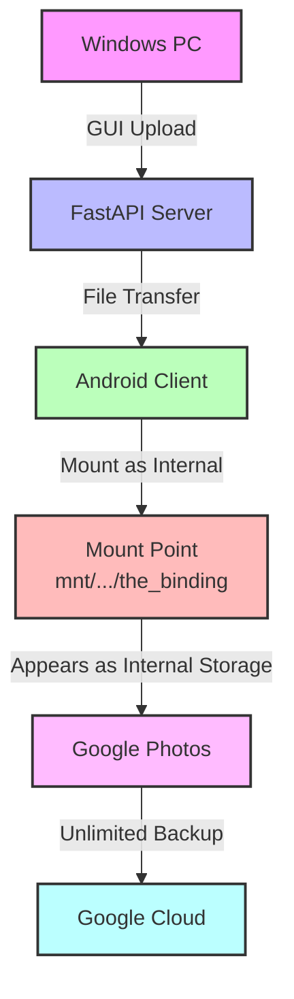
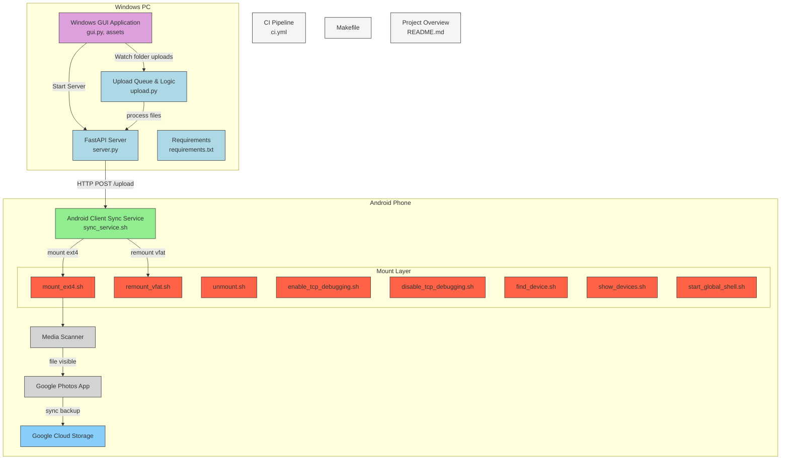

# Pixel Backup Gang

Mount ext4 drives & remount FAT32 drives into the Google Pixel's internal storage for unlimited Google Photos backup.

**WARNING: this code is experimental and there is no guarantee that it works. rooting your phone or running any commands as root can be very dangerous. you have been warned.**

## Why?

The main goal is to allow for easy backup of external media via Google Photos on original Google Pixel phones, which have an unlimited storage benefit. The "usual" method is to copy every file to the device's internal storage, which can incur terabytes of unnecessary writes to the limited lifetime of the internal flash memory.

## System Architecture

### High-Level Flow


### Detailed Technical Architecture


## Features

### The Good
* Works with the stock kernel
* Backs up external files larger than 4GB
* Reduces wear on internal flash storage
* Prevents device from overheating
* Makes 32GB Pixels viable for mass backup
* **NEW**: Wireless file transfer via GUI
* **NEW**: No need for physical USB connection
* **NEW**: Automatic file detection and mounting

### The Bad
* Phone needs to be rooted
* Requires initial setup

### Components

1. **Windows GUI Application**
   - Easy-to-use interface for file uploads
   - Automatic file watching
   - Real-time transfer status
   - No command line needed

2. **FastAPI Server**
   - Handles file transfers
   - Manages upload queue
   - Provides status updates

3. **Android Client**
   - Automatically syncs new files
   - Mounts files as internal storage
   - Triggers Google Photos backup

## Setup Instructions

### Prerequisites
* A Google Pixel (sailfish) or Google Pixel XL (marlin) on Android 10, rooted with [Magisk](https://github.com/topjohnwu/Magisk)
* Python 3.8+ installed on Windows
* Network connectivity between PC and phone

### Windows Setup

1. **Install Python Requirements**:
   ```powershell
   cd server
   pip install -r requirements.txt
   ```

2. **Start the GUI**:
   ```powershell
   python gui.py
   ```

3. **GUI Usage**:
   - Note the displayed IP address
   - Click "Start Server"
   - Select a watch folder
   - Any files added to this folder will automatically upload

### Android Setup

1. **Install Scripts**:
   ```bash
   # Via terminal on phone
   su
   cd /data/local/tmp
   
   # Copy sync_service.sh to this location and make executable
   chmod +x sync_service.sh
   ```

2. **Start the Sync Service**:
   ```bash
   ./sync_service.sh http://<your-pc-ip>:8000
   ```
   Replace `<your-pc-ip>` with the IP shown in the GUI

### Usage

1. **Adding Files for Backup**:
   - Simply drop files into the watch folder selected in the GUI
   - The GUI will show upload progress
   - Files appear automatically on your phone
   - Google Photos backs them up with unlimited storage

2. **Monitoring Status**:
   - GUI shows real-time upload status
   - Check Google Photos app for backup status
   - Log window shows all activity

## Technical Details

### File Flow
1. Files added to watch folder
2. FastAPI server receives and stores files
3. Android client detects new files
4. Files mounted to `/mnt/runtime/write/emulated/0/the_binding`
5. Android media scanner triggered
6. Google Photos detects files as internal storage
7. Unlimited backup begins

### Security Notes
* Currently, the mounting script disables selinux security controls
* SELinux remains disabled until next boot
* Can run `setenforce 1` to re-enable earlier
* Keep device radios off when possible to reduce attack surface
* No persistent changes beyond script installation

## Troubleshooting

### Common Issues
1. **GUI Won't Start**:
   - Ensure all Python requirements are installed
   - Try reinstalling PyQt6 if you see DLL errors

2. **Upload Failures**:
   - Check network connectivity
   - Verify server is running
   - Check watch folder permissions

3. **Files Not Appearing in Google Photos**:
   - Verify sync service is running
   - Check mount point permissions
   - Ensure Google Photos has storage permissions

## Contributing

Contributions are welcome! Please read the contributing guidelines before submitting pull requests.

## License

This project is licensed under the MIT License - see the LICENSE file for details.
